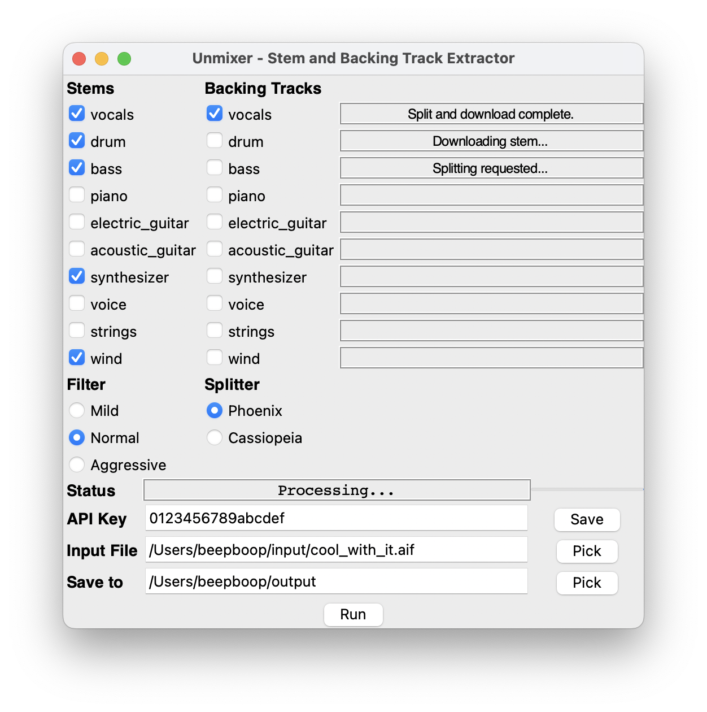

# Welcome to Unmixer

Unmixer unmixes music.  It will take a recording of multiple instruments playing concurrently and with varying degrees of quality, extract the vocals, drum, bass, piano, electric guitar, acoustic guitar, synthesizer, strings and winds.

Unmixer is nothing more (or less) than a GUI frontend for LALAL.AI's AI-powered stem-splitting technology.

### Why UnMixer

If you don't use UnMixer, you either need to use [lalal.ai's website](https://lalal.ai/), where you have to upload the file repeatedly for each track you want to extract, or lalal's python program, [lalalai_splitter](https://github.com/OmniSaleGmbH/lalalai), where you also have to run the program and upload the file repeatedly for each track you want to extract, or [my version](https://github.com/lehenbauer/lalalai) of the python program, lalali_splitter, which will only upload the file once and do all of the splitting in one run, and can also avoid downloading unwanted backing tracks or downloading backing tracks without the corresponding stems.

It's pretty cool, but that python command line is kind of daunting.  You need to tell it the input file, the output directory, the stems you want, the backing tracks you want, the filter and model settings, and your API key.

UnMixer gives you a nice graphical interface to do all that.

Unmixer is not associated with LALAL.AI, just a personal project to help make music tools more accessible to musicians and composers.

### Fees for lalal.ai

LALAL.AI costs money, and you need to register and get an API key.  They currently charge $15 for 90 minutes, $50 for 300 minutes or $70 for 550 minutes.  They run sales fairly often and they have big discounts for bulk pricing.  Their most expensive tier without discounts is about 17 cents per minute; prices fall rapidly if you buy larger minute increments, as little as 6 cents per minute.

You pay by the minute, per stem/backing track combo.  That is, it costs no more to get the stem and backing track for one part than to get just one of the two.

So for example if you wanted to extract five parts from a four-minute song, you will be charged for 20 minutes.

### Requirements

It currently runs on Macs with reasonably current MacOS. It ought to be able to be ported to Windows and/or Linux.  I am not taking that on at this time but will entertain pull requests if someone is motivated to make it work.

### How To Install It

Go to the latest release at https://github.com/lehenbauer/unmixer/releases and download the .dmg file.

Open the .dmg file and drag the UnMixer icon to the Applications folder.

### How To Run It

Double-click on the UnMixer icon.

You will need to acquire an API key from lalal.ai and paste it into the API Key field in UnMixer, and hit Save.  The key should be 16 characters and consist of only digits and the letters 'abcdef'.

Pick the song you want to extract stems and/or backing tracks for by hitting "Pick" next to "Input File".

Pick the directory you want to save extracted stems and/or backing tracks to by hitting "Pick" next to "Save to".  The save-to folder is sticky so it will be set to the same value across runs of Unmixer.

Click on all the stems and backing tracks that you want to extract.  Remember that if you pick a stem or backing track, it is free to get the corresponding backing track or stem for the same instrument.

When you're all set, click Run.  UnMixer will show its status in the Status area and the status of the individual extractions as they move through being processed and then downloaded.

An indicator next to the Status area will move left and riight to show that it's working.

If all goes well, the status will conclude with "All Done." and all your stems and backing tracks should be present in your Save-to folder.

### developers developers developers developers

If you are interested in banging on UnMixer, clone the repo and have at it.

Create a python virtual environment with something like `python -m venv unmixenv` that has wheel, black the latest pip, and whatever I missed, when building/testing, and activate it.

to run the program from the command line, `python3 UnMixer.py`  This can be handy versus an icon launch because you might see more in the event of a failure.

To build the release, `make build`.

to build the disk image, you'll need the [homebrew package manager](https://brew.sh) (and to install homebrew, you'll need Xcode -- but don't worry, it's free.)

Once you've got brew up and running, install the create-dmg package by running `brew install create-dmg`.

After you've got a build, `make dmg` should make UnMixer.dmg in the top directory of UnMixer.

